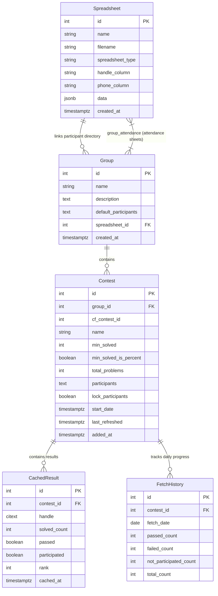

# Data Model Specification: CF Tracker Rebuild

**Feature**: `001-rebuild-cf-tracker` | **Date**: 2026-09-09

This document details the target PostgreSQL relational schema and Async SQLAlchemy 2.0 models, preserving legacy entity parity while enforcing relational integrity, case-insensitive handle semantics, and high-performance JSONB storage.

---

## 1. Entity Relationship Diagram

---

## 2. PostgreSQL Schema & Model Specifications

### 2.1 Extension Requirements
- `CREATE EXTENSION IF NOT EXISTS "citext";` (Enables native case-insensitive text type `CITEXT` for Codeforces handles).

### 2.2 Table: `spreadsheets`
Stores uploaded CSV datasets (student directories and session attendance rosters).

| Column | Type | Constraints | Default | Description |
|---|---|---|---|---|
| `id` | `INTEGER` | `PRIMARY KEY`, Auto-increment | — | Unique identifier |
| `name` | `VARCHAR(100)` | `NOT NULL` | — | Human-readable sheet title |
| `filename` | `VARCHAR(255)` | `NOT NULL` | `''` | Original uploaded filename |
| `spreadsheet_type`| `VARCHAR(20)` | `NOT NULL` | `'participants'`| `'participants'` or `'attendance'` |
| `handle_column` | `VARCHAR(100)`| `NOT NULL` | `'Codeforces Handle'` | Header name for CF handle |
| `phone_column` | `VARCHAR(100)`| `NOT NULL` | `'WhatsApp Number'` | Header name for phone number |
| `data` | `JSONB` | `NOT NULL` | `'{"columns":[], "rows":[]}'` | Parsed CSV columns and row objects |
| `created_at` | `TIMESTAMPTZ` | `NOT NULL` | `CURRENT_TIMESTAMP` | Upload timestamp (UTC) |

**Indexes**:
- `ix_spreadsheets_type` ON `spreadsheets (spreadsheet_type)`

---

### 2.3 Table: `groups`
Represents an ICPC training group or student division.

| Column | Type | Constraints | Default | Description |
|---|---|---|---|---|
| `id` | `INTEGER` | `PRIMARY KEY`, Auto-increment | — | Unique identifier |
| `name` | `VARCHAR(100)` | `NOT NULL` | — | Group name |
| `description` | `TEXT` | `NOT NULL` | `''` | Optional details/notes |
| `default_participants`| `TEXT` | `NOT NULL` | `''` | Comma-separated default handles |
| `spreadsheet_id`| `INTEGER` | `FOREIGN KEY (spreadsheets.id) ON DELETE SET NULL` | `NULL` | Linked participant sheet |
| `created_at` | `TIMESTAMPTZ` | `NOT NULL` | `CURRENT_TIMESTAMP` | Creation timestamp (UTC) |

---

### 2.4 Association Table: `group_attendance`
Many-to-many link between groups and attendance spreadsheets.

| Column | Type | Constraints | Description |
|---|---|---|---|
| `group_id` | `INTEGER` | `PRIMARY KEY`, `FOREIGN KEY (groups.id) ON DELETE CASCADE` | Group identifier |
| `spreadsheet_id` | `INTEGER` | `PRIMARY KEY`, `FOREIGN KEY (spreadsheets.id) ON DELETE CASCADE` | Attendance spreadsheet ID |

---

### 2.5 Table: `contests`
Tracks a Codeforces contest assigned to a group.

| Column | Type | Constraints | Default | Description |
|---|---|---|---|---|
| `id` | `INTEGER` | `PRIMARY KEY`, Auto-increment | — | Unique identifier |
| `group_id` | `INTEGER` | `NOT NULL`, `FOREIGN KEY (groups.id) ON DELETE CASCADE` | — | Associated training group |
| `cf_contest_id` | `INTEGER` | `NOT NULL` | — | Official Codeforces contest ID |
| `name` | `VARCHAR(200)` | `NOT NULL` | — | Contest name |
| `min_solved` | `INTEGER` | `NOT NULL` | `1` | Passing criteria value |
| `min_solved_is_percent` | `BOOLEAN`| `NOT NULL` | `FALSE` | If true, `min_solved` is a % |
| `total_problems` | `INTEGER` | `NOT NULL` | `0` | Total problem count in contest |
| `participants` | `TEXT` | `NOT NULL` | `''` | Comma-separated participant handles |
| `lock_participants`| `BOOLEAN` | `NOT NULL` | `FALSE` | Disables auto-import from CF |
| `start_date` | `TIMESTAMPTZ` | `NULL` | `NULL` | Contest start time on Codeforces |
| `last_refreshed`| `TIMESTAMPTZ` | `NULL` | `NULL` | Last results synchronization |
| `added_at` | `TIMESTAMPTZ` | `NOT NULL` | `CURRENT_TIMESTAMP` | Added to group timestamp |

**Indexes**:
- `ix_contests_group_id` ON `contests (group_id)`
- `ix_contests_cf_contest_id` ON `contests (cf_contest_id)`

---

### 2.6 Table: `cached_results`
Stores evaluated results per participant in a contest.

| Column | Type | Constraints | Default | Description |
|---|---|---|---|---|
| `id` | `INTEGER` | `PRIMARY KEY`, Auto-increment | — | Unique identifier |
| `contest_id` | `INTEGER` | `NOT NULL`, `FOREIGN KEY (contests.id) ON DELETE CASCADE` | — | Target contest |
| `handle` | `CITEXT` | `NOT NULL` | — | Participant Codeforces handle |
| `solved_count` | `INTEGER` | `NOT NULL` | `0` | Number of problems solved |
| `passed` | `BOOLEAN` | `NOT NULL` | `FALSE` | Met or exceeded pass threshold |
| `participated` | `BOOLEAN` | `NOT NULL` | `TRUE` | False if registered but 0 submissions |
| `rank` | `INTEGER` | `NOT NULL` | `0` | Official contest rank (0 if not in CF) |
| `cached_at` | `TIMESTAMPTZ` | `NOT NULL` | `CURRENT_TIMESTAMP` | Result fetch timestamp |

**Constraints & Indexes**:
- `uq_contest_handle` UNIQUE (`contest_id`, `handle`)
- `ix_cached_results_contest_id` ON `cached_results (contest_id)`
- `ix_cached_results_handle` ON `cached_results (handle)`

---

### 2.7 Table: `fetch_history`
Daily aggregated snapshot of contest outcomes for historical progress tracking.

| Column | Type | Constraints | Default | Description |
|---|---|---|---|---|
| `id` | `INTEGER` | `PRIMARY KEY`, Auto-increment | — | Unique identifier |
| `contest_id` | `INTEGER` | `NOT NULL`, `FOREIGN KEY (contests.id) ON DELETE CASCADE` | — | Target contest |
| `fetch_date` | `DATE` | `NOT NULL` | — | Snapshot date (UTC) |
| `passed_count` | `INTEGER` | `NOT NULL` | `0` | Total students passing |
| `failed_count` | `INTEGER` | `NOT NULL` | `0` | Total students failing |
| `not_participated_count`| `INTEGER` | `NOT NULL` | `0` | Registered but not entered |
| `total_count` | `INTEGER` | `NOT NULL` | `0` | Total roster count |

**Constraints & Indexes**:
- `uq_contest_fetch_date` UNIQUE (`contest_id`, `fetch_date`)
- `ix_fetch_history_contest_id` ON `fetch_history (contest_id)`

---

## 3. Business Logic & Scoring Rules

### 3.1 Passing Criteria Calculation
$$\text{required\_solved} = \begin{cases} \max(1, \lfloor \text{total\_problems} \times \frac{\text{min\_solved}}{100} \rfloor) & \text{if } \text{min\_solved\_is\_percent} \land \text{total\_problems} > 0 \\ \text{min\_solved} & \text{otherwise} \end{cases}$$

### 3.2 Participant Status Determination
- **`participated`**: `True` if participant exists in Codeforces standings rows (`participated = True`), `False` otherwise.
- **`passed`**: `True` if `participated` is `True` and `solved_count >= required_solved`, `False` otherwise.

### 3.3 Overview Matrix Scoring Formula
For each participant in a training group across a selected set of contests:
$$\text{Points} = (\text{Total Passes} \times 5) + (\text{Total Solved} \times 1) + (\text{Attendance Count} \times 1)$$
Where `Attendance Count` equals the number of linked attendance spreadsheets in which the participant's case-insensitive handle is present.
