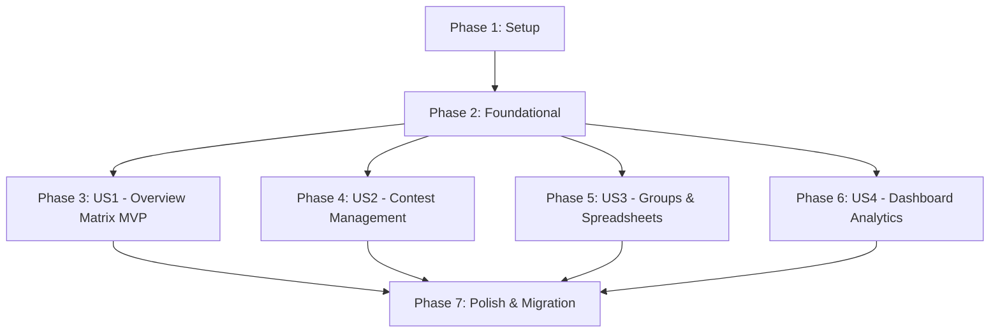

# Implementation Tasks: CF Tracker Rebuild

**Feature**: `001-rebuild-cf-tracker` | **Date**: 2026-09-09  
**Specification**: [spec.md](file:///c:/Users/kareemghazi/Desktop/ICPC%20NMU/cf-tracker/specs/001-rebuild-cf-tracker/spec.md) | **Plan**: [plan.md](file:///c:/Users/kareemghazi/Desktop/ICPC%20NMU/cf-tracker/specs/001-rebuild-cf-tracker/plan.md)

---

## Phase 1: Setup (Shared Infrastructure)

**Purpose**: Project initialization, environment setup, and baseline container orchestration.

- [X] T001 Create project directory structure for decoupled architecture (`backend/` and `frontend/`)
- [X] T002 [P] Create `docker-compose.yml` defining PostgreSQL 15 and Redis 7 services with health checks
- [X] T003 [P] Initialize Python backend configuration in `backend/requirements.txt` with FastAPI, SQLAlchemy 2.0, asyncpg, Alembic, Celery, Redis, HTTPX, and pydantic-settings
- [X] T004 [P] Initialize Next.js 14+ TypeScript project in `frontend/package.json` with Tailwind CSS, Lucide Icons, `@tanstack/react-table`, and `@tanstack/react-virtual`
- [X] T005 [P] Configure environment settings class using Pydantic Settings in `backend/app/core/config.py` loading database URIs, Redis URLs, and Codeforces credentials
- [X] T006 [P] Configure Tailwind CSS theme, font variables, and dark mode palette matching `assets/` branding in `frontend/tailwind.config.ts` and `frontend/src/app/globals.css`

---

## Phase 2: Foundational (Blocking Prerequisites)

**Purpose**: Core persistence, rate-limiting, background worker, and API client infrastructure that MUST be complete before ANY user story can be implemented.

- [X] T007 Setup Async SQLAlchemy 2.0 engine, async sessionmaker, and `get_db` dependency in `backend/app/core/database.py`
- [X] T008 Initialize Alembic async migration environment with PostgreSQL `CITEXT` extension activation in `backend/alembic/env.py` and `backend/alembic.ini`
- [X] T009 [P] Create Declarative Base class with UTC timestamp audit mixin (`created_at`, `updated_at`) in `backend/app/models/base.py`
- [X] T010 [P] Implement Redis token-bucket distributed rate limiter enforcing minimum 2.0s delay between outbound requests in `backend/app/core/rate_limiter.py`
- [X] T011 [P] Configure Celery worker application with Redis message broker and result backend in `backend/app/workers/celery_app.py`
- [X] T012 [P] Implement asynchronous Codeforces API client using `httpx.AsyncClient` with HMAC-SHA512 request signing (`apiSig`) and exponential backoff retry in `backend/app/services/codeforces.py`
- [X] T013 Setup root FastAPI application with CORS middleware, lifespan events, centralized error handlers, and `/api/v1` router mount in `backend/app/main.py`
- [X] T014 [P] Setup Shadcn UI primitives (`Button`, `Card`, `Dialog`, `Badge`, `Tabs`, `DropdownMenu`, `Input`, `Select`, `Toast`) in `frontend/src/components/ui/`
- [X] T015 [P] Implement typed HTTP API client wrapper with standardized error handling in `frontend/src/lib/api-client.ts`
- [X] T016 [P] Implement Egyptian phone formatting (`formatEgyptPhone`) and WhatsApp link utility in `frontend/src/lib/phone-formatter.ts`

**Checkpoint**: Foundation ready — database connection, rate-limited worker, and UI primitives verified.

---

## Phase 3: User Story 1 - Group Overview Matrix & Performance Tracking (Priority: P1) 🎯 MVP

**Goal**: Provide a high-performance virtualized matrix table displaying all participants across contests in a training group, with sticky handle columns, attendance scores, points scoring formula, contest chip filtering, column toggles, and participant drawer.

**Independent Test**: Create a group with 2 contests and mock participants, open the Overview tab, and verify that the virtualized matrix renders with sticky handle columns, visual status indicators (`✅`, `❌`, `⚪`), points calculation `(Passes * 5) + (Solved * 1) + (Attendance * 1)`, and interactive column/contest filters.

### Implementation for User Story 1

- [X] T017 [P] [US1] Create `Spreadsheet` and `group_attendance` association models with constraint `JSONB NOT NULL DEFAULT '{"columns":[], "rows":[]}'` in `backend/app/models/spreadsheet.py` and `backend/app/models/association.py`
- [X] T018 [P] [US1] Create `Group` model with cascade delete relationships to contests and M2M attendance sheets in `backend/app/models/group.py`
- [X] T019 [P] [US1] Create `Contest` model with fields `min_solved`, `min_solved_is_percent`, `total_problems`, `participants`, `lock_participants` in `backend/app/models/contest.py`
- [X] T020 [P] [US1] Create `CachedResult` model with `CITEXT NOT NULL` handle and unique constraint `(contest_id, handle)` in `backend/app/models/result.py`
- [X] T021 [US1] Implement group overview matrix aggregation service (`matrix_builder.py`) calculating passes, solved counts, attendance lookup, and points in `backend/app/services/matrix_builder.py`
- [X] T022 [US1] Implement `GET /api/v1/groups/{id}/overview` endpoint returning full matrix dataset in `backend/app/api/v1/endpoints/groups.py`
- [X] T023 [P] [US1] Create Pydantic schemas for overview matrix responses (`OverviewResponse`, `ParticipantOverview`, `ContestOverviewHeader`) in `backend/app/schemas/group.py`
- [X] T024 [P] [US1] Implement Participant Metadata Drawer component (`📋`) displaying full CSV row data and CF profile link in `frontend/src/components/spreadsheet/ParticipantDrawer.tsx`
- [X] T025 [US1] Construct virtualized 2D matrix table component using `@tanstack/react-table` v8 and `@tanstack/react-virtual` with sticky handle columns in `frontend/src/components/matrix/OverviewMatrix.tsx`
- [X] T026 [US1] Implement contest filter chips (All / None / Toggle) and summary column toggles (Passes, Solved, Attendance, Points) in `frontend/src/components/matrix/OverviewControls.tsx`
- [X] T027 [US1] Assemble Group Detail & Overview page integrating table, controls, and WhatsApp links in `frontend/src/app/groups/[id]/page.tsx`

**Checkpoint**: User Story 1 is fully functional and independently testable as an MVP.

---

## Phase 4: User Story 2 - Contest Management & Results Tracking (Priority: P2)

**Goal**: Add Codeforces contests (single and batch), configure pass criteria (count vs percentage), trigger background standings sync via Celery, and display Results, Standings, and Progress views.

**Independent Test**: Add a contest by ID, configure passing criteria (e.g., 3 problems or 50%), trigger a refresh, observe asynchronous completion without UI blocking, and review evaluated results in Results, Standings, and Progress tabs.

### Implementation for User Story 2

- [X] T028 [P] [US2] Create `FetchHistory` model with unique constraint `(contest_id, fetch_date)` for daily progress tracking in `backend/app/models/fetch_history.py`
- [X] T029 [P] [US2] Create Pydantic schemas for Contest CRUD, results, standings, and refresh requests in `backend/app/schemas/contest.py`
- [X] T030 [US2] Implement scoring service for pass/fail determination (`required_solved = max(1, int(total_problems * min_solved / 100))` if percent else `min_solved`) in `backend/app/services/scoring.py`
- [X] T031 [US2] Implement Celery background task `refresh_contest_results` with 2s rate-limiting and auto-import in `backend/app/workers/tasks.py`
- [X] T032 [US2] Implement task status polling endpoint `GET /api/v1/tasks/{task_id}` in `backend/app/api/v1/endpoints/tasks.py`
- [X] T033 [US2] Implement Contest REST endpoints (`POST /contests`, `GET/PUT/DELETE /contests/{id}`, `POST /contests/{id}/refresh`, `GET /results`, `GET /standings`, `GET /progress`) in `backend/app/api/v1/endpoints/contests.py`
- [X] T034 [P] [US2] Implement Contest Results view with real-time status filtering (All, Passed, Failed, Participated, Not Entered) and clipboard export in `frontend/src/components/contest/ContestResults.tsx`
- [X] T035 [P] [US2] Implement Contest Standings leaderboard view with top-3 rank highlights (gold, silver, bronze) in `frontend/src/components/contest/ContestStandings.tsx`
- [X] T036 [P] [US2] Implement Contest Progress timeline chart with historical pass rate trends in `frontend/src/components/contest/ContestProgress.tsx`
- [X] T037 [US2] Build Contest Management page with refresh triggering, task status polling, and view tabs in `frontend/src/app/contests/[id]/page.tsx`
- [X] T038 [US2] Implement Add Contest & Batch Add Contest modals with pass threshold inputs in `frontend/src/components/contest/AddContestModal.tsx`

**Checkpoint**: User Stories 1 and 2 both operate seamlessly with real-time data ingestion.

---

## Phase 5: User Story 3 - Training Group & Spreadsheet Roster Management (Priority: P3)

**Goal**: Manage training groups, configure default participant rosters, bulk-apply to contests, and upload/link CSV spreadsheets for participants and attendance.

**Independent Test**: Create a group, upload participant and attendance spreadsheets, link them to the group, define default participants, and apply them across contests.

### Implementation for User Story 3

- [X] T039 [P] [US3] Create Pydantic schemas for Spreadsheet upload, column mapping, and group CRUD in `backend/app/schemas/spreadsheet.py`
- [X] T040 [US3] Implement CSV parsing service with column detection and handle normalization in `backend/app/services/spreadsheet_parser.py`
- [X] T041 [US3] Implement Spreadsheet endpoints (`POST /upload`, `GET /spreadsheets`, `GET/PUT/DELETE /spreadsheets/{id}`, `GET /participant/{handle}`) in `backend/app/api/v1/endpoints/spreadsheets.py`
- [X] T042 [US3] Implement Group CRUD endpoints and `POST /groups/{id}/apply-participants` in `backend/app/api/v1/endpoints/groups.py`
- [X] T043 [P] [US3] Implement CSV Upload modal with column picker (handle, phone, sheet type) in `frontend/src/components/spreadsheet/SpreadsheetUploadModal.tsx`
- [X] T044 [P] [US3] Build Spreadsheets page with tabbed views for Participant and Attendance sheets in `frontend/src/app/spreadsheets/page.tsx`
- [X] T045 [US3] Build Groups management page with group creation, edit modal, and default participants editor in `frontend/src/app/groups/page.tsx`

**Checkpoint**: Group and spreadsheet management fully integrated with roster linkage.

---

## Phase 6: User Story 4 - High-Level Dashboard & Analytics (Priority: P4)

**Goal**: Replicate analytics dashboard summary metrics (total groups, contests, participants, pass rate) and individual group cards.

**Independent Test**: Open the dashboard route and verify summary cards and group breakdown table accurately reflect aggregate statistics across all training groups.

### Implementation for User Story 4

- [X] T046 [P] [US4] Create Pydantic schemas for dashboard statistics and group cards in `backend/app/schemas/analytics.py`
- [X] T047 [US4] Implement analytics aggregation service and `GET /api/v1/analytics` endpoint in `backend/app/api/v1/endpoints/analytics.py`
- [X] T048 [P] [US4] Build Dashboard summary metric cards with iconography in `frontend/src/components/dashboard/StatsGrid.tsx`
- [X] T049 [US4] Build Groups Overview summary table with pass rate badges and quick actions in `frontend/src/components/dashboard/GroupsTable.tsx`
- [X] T050 [US4] Assemble main Dashboard page in `frontend/src/app/page.tsx`

**Checkpoint**: Full user journey from executive dashboard to granular contest standings verified.

---

## Phase 7: Polish, Migration & Cross-Cutting Concerns

**Purpose**: Legacy data migration, Codeforces contest discovery, validation, and documentation.

- [X] T051 [P] Create SQLite-to-PostgreSQL migration script migrating legacy SQLite databases in `instance/` to PostgreSQL in `backend/scripts/migrate_sqlite_to_pg.py`
- [X] T052 [P] Implement Codeforces contest search endpoint `GET /api/v1/codeforces/search` in `backend/app/api/v1/endpoints/codeforces.py`
- [X] T053 [P] Implement contest search auto-complete component in `frontend/src/components/contest/ContestSearchInput.tsx`
- [X] T054 Generate and run initial Alembic migration creating all PostgreSQL tables with indexes and `CITEXT` extension in `backend/alembic/versions/`
- [X] T055 Execute end-to-end validation scenarios and verify against `specs/001-rebuild-cf-tracker/quickstart.md`

---

## Dependencies & Execution Order

### Phase Dependencies

### User Story Dependencies

- **User Story 1 (P1)**: Depends on Phase 2. Can be built and validated as a standalone MVP using seeded contest results.
- **User Story 2 (P2)**: Depends on Phase 2. Integrates with US1 models to provide live Codeforces data ingestion.
- **User Story 3 (P3)**: Depends on Phase 2. Provides spreadsheet roster linkage for US1 and US2.
- **User Story 4 (P4)**: Depends on Phase 2. Reads aggregate data across groups and contests.

### Parallel Execution Opportunities

- In **Phase 1**: T002, T003, T004, T005, T006 can all be executed in parallel.
- In **Phase 2**: T009, T010, T011, T012, T014, T015, T016 can be executed concurrently across backend and frontend.
- In **Phase 3 (US1)**: Models T017–T020 can be created in parallel; Frontend components T024–T026 can be developed concurrently with backend endpoints.
- In **Phase 4 (US2)**: Views T034–T036 can be developed in parallel while backend tasks T031–T033 are wired up.
- In **Phase 7**: Migration script T051 and Codeforces search T052/T053 can proceed independently.

---

## Implementation Strategy

### MVP Scope: User Story 1 (Phase 1 + Phase 2 + Phase 3)
1. Initialize infrastructure (`docker-compose.yml`, FastAPI, Next.js).
2. Establish database models, session management, and rate-limited worker.
3. Build the virtualized Overview Matrix table and API endpoint.
4. **Validation Point**: Verify smooth 60fps scrolling across 300+ participants, sticky handle columns, points scoring, and participant drawer.
